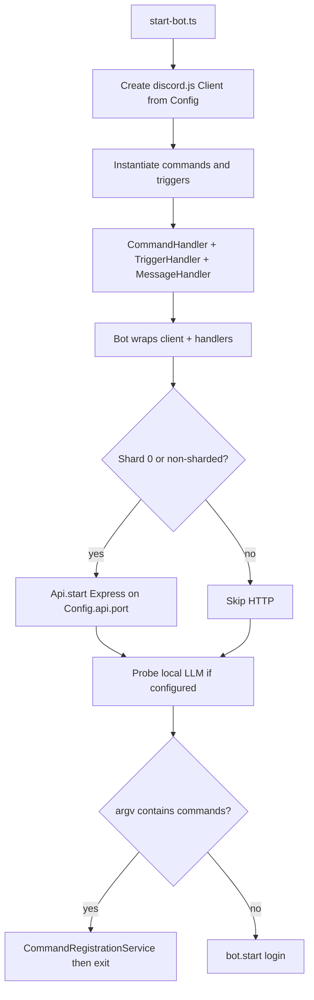
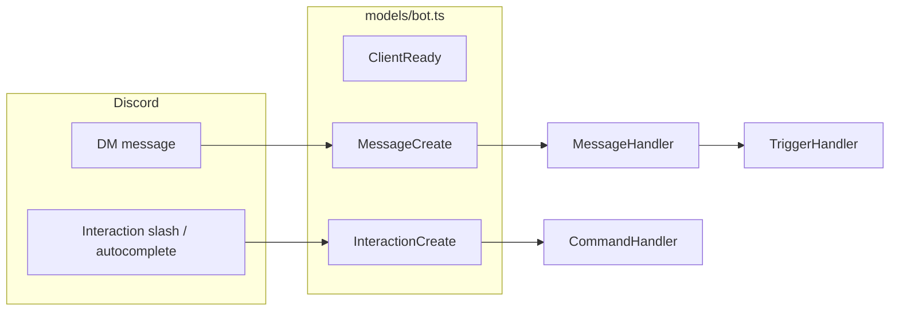

# Project architecture and flow

This repository is a **Discord bot** (TypeScript, discord.js v14, ESM) focused on **direct messages (DMs)** and **Google Calendar**: viewing upcoming events via a slash command and adding events via a natural-language DM trigger, optionally parsed by a **local LLM** (Ollama-compatible HTTP API).

The following sections describe **how the code is laid out** and **what happens at runtime** in the current codebase.

---

## Layout (where things live)

| Area | Path | Role |
|------|------|------|
| Entry | `src/start-bot.ts` | Builds `Client`, wires handlers, optionally starts HTTP API and command CLI, then starts the bot |
| Bot lifecycle | `src/models/bot.ts` | Subscribes to Discord events and forwards work to `MessageHandler` / `CommandHandler` |
| HTTP sidecar | `src/models/api.ts` | Express app mounting controllers (OAuth callback, health-style root) |
| Slash commands | `src/commands/` | Command classes + `metadata.ts` for Discord REST registration |
| Message triggers | `src/triggers/` | Regex / predicate-driven reactions to DMs |
| Discord routing | `src/events/` | `CommandHandler`, `MessageHandler`, `TriggerHandler` |
| Integrations | `src/services/` | Logging, command registration, Google OAuth/tokens, Calendar API, optional local LLM parsing |
| Config | `src/config.ts`, `config/config.json`, `.env` | File config merged with environment overrides (secrets, LLM toggles) |
| Strings | `lang/logs.json` | Log message templates |

Compiled output goes to `dist/`; `npm start` runs `tsc` then `node dist/start-bot.js`.

---

## Startup sequence

Notable details:

- **HTTP server**: Started only when the client is not sharded or when `client.shard.ids[0] === 0`, so a single listener handles OAuth in typical single-process runs.
- **Slash command administration**: Passing `commands` as the first CLI argument (see `package.json` scripts such as `commands:register`) registers or inspects commands via Discord’s REST API, then exits without logging the bot in for normal operation.
- **Unhandled rejections** are logged globally in `start-bot.ts`.

---

## Runtime: Discord event flow

### Constraints enforced today

- **`MessageHandler`** ignores guild messages, system messages, and the bot’s own messages; everything else goes to **`TriggerHandler`** (still DM-only because guild messages never reach triggers).
- **`CommandHandler`** ignores bots and **ignores all guild interactions**—slash commands are effectively **DM-only** in this codebase.
- **`debug.json`** can enable **dummy mode**: only whitelisted user IDs are processed for messages and interactions.

Rate limiting uses `discord.js-rate-limiter` separately for **commands** and **triggers** (`Config.rateLimiting.*`).

---

## Features mapped to code

### Slash command: `/gcalendar`

- **Class**: `src/commands/chat/gcalendar-command.ts` (`GCalendarCommand`).
- **Registration payload**: `src/commands/metadata.ts` → `ChatCommandMetadata`.
- **Flow**: Load Google credentials via `getAuthenticatedClient`; if missing, reply with an OAuth link generated by `createOAuth2Client`. If authenticated, list up to ten upcoming events from the primary calendar and send an embed. On `invalid_grant`, tokens can be cleared and the user is prompted to authorize again.

### DM trigger: “add calendar …” / “add event …”

- **Class**: `src/triggers/add-calendar-trigger.ts`.
- **Who**: Only users whose Discord ID appears in `Config.developers`.
- **Pattern**: Message must match `^add\s+(?:calendar|event)\s+(.+)$` (case-insensitive), remainder is the natural-language payload.
- **Calendar auth**: Same Google OAuth stack as slash commands; if not connected, user is told to use `/gcalendar` first.
- **Parsing**:
  - If **`Config.localLlm.enabled`** is true, **`parseEventsWithLocalLlm`** (`src/services/local-llm-event-parser.ts`) calls the configured HTTP endpoint (e.g. Ollama). Returned JSON is turned into one or more Calendar inserts via **`insertEvent`** (`src/services/calendar-service.ts`).
  - If the LLM returns nothing usable, **`chrono-node`** parses a single datetime from the text for a fallback single-event path (see the rest of `AddCalendarTrigger`).

### HTTP API (Express)

- **`OAuthController`** (`src/controllers/oauth-controller.ts`): `GET /oauth/callback` exchanges `code` for tokens and persists them with **`saveTokens`** (`src/services/gcalendar-auth.ts`), producing a simple HTML success/failure page.
- **`RootController`**: `GET /` returns a small JSON payload identifying the service.

Controllers implement `Controller` (`src/controllers/controller.ts`). Optional `authToken` would attach `checkAuth` middleware (`src/middleware/check-auth.ts`); current controllers do not set it.

### Configuration

- **`src/config.ts`** loads **`config/config.json`**, overlays secrets and overrides from **environment variables** (documented in the header comment of `config.ts`), and loads **`.env`** from the process cwd when present.
- **Google tokens on disk**: `config/google-tokens.json` path is defined in **`gcalendar-auth`** (`TOKEN_PATH`).

---

## Adding new behavior (pattern used here)

1. **New slash command**: Add a class under `src/commands/` implementing `Command`, export command metadata in `src/commands/metadata.ts`, append the instance to the `commands` array in `src/start-bot.ts`, run `npm run commands:register`.
2. **New DM trigger**: Implement `Trigger` in `src/triggers/`, add an instance to `triggers` in `src/start-bot.ts`.
3. **New HTTP route**: Add a `Controller`, pass it into `new Api([...])` in `src/start-bot.ts`.

---

## Mental model

Think of the process as **one Node service** that does two jobs in parallel after startup:

1. **Discord client**: listens for DMs and DM slash interactions, routes them through handlers to calendar / LLM logic.
2. **Small REST surface**: completes the Google OAuth redirect and exposes a trivial root route.

Shared state for Google access is **token persistence on disk** plus **`config/config.json` + env** for OAuth client IDs and bot credentials.
