# Central Backend + Event-Based Plugin Platform

This architecture is essentially:

```text
One Backend
Many Interfaces
Event-Driven Extensions
```

The goal is:

```text
Discord
Website
Mobile App
CLI
Future Integrations
        ↓
   Same Core Logic
        ↓
   Event Bus
        ↓
      Plugins
```

---

# One-Sentence Summary

Build a simple service-based backend that emits events, and allow plugins to subscribe to those events while all clients remain thin API consumers.

---

# High-Level Overview

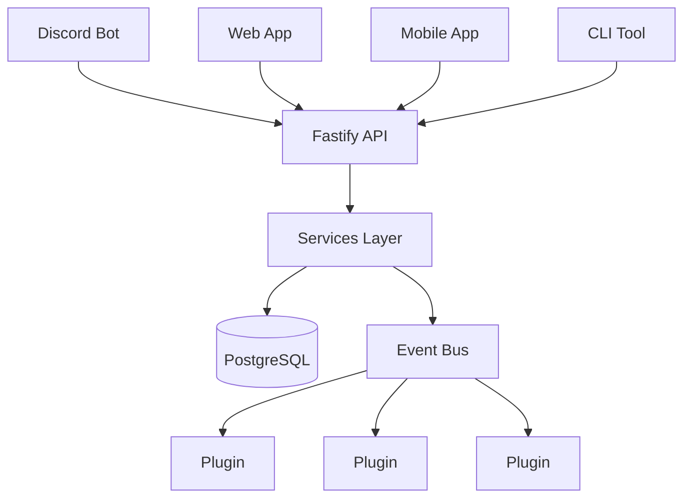

---

# Core System Design

```text
Clients (Discord / Web / Mobile)
        ↓
        API (Fastify)
        ↓
     Services
        ↓
   PostgreSQL
        ↓
   Event Bus
        ↓
     Plugins
```

---

# Key Architectural Principles

## 1. Thin Clients

All clients are dumb adapters:

* Send requests to backend
* Render responses
* No business logic

```text
Discord / Web / Mobile = UI only
```

Bad:

```text
Discord Bot
 ├─ business logic
 ├─ permissions
 ├─ workflows
 └─ database access
```

Good:

```text
Discord Bot
 └─ API Calls

Web App
 └─ API Calls

Mobile App
 └─ API Calls
```

---

## 2. Service-Oriented Backend

Business logic lives in services.

Examples:

```text
UserService
TaskService
MessageService
PermissionService
```

Responsibilities:

```text
Validation
Business rules
Database writes
Emitting events
```

Example:

```ts
taskService.createTask(task)
```

---

## 3. Event-Based Extensibility

Instead of hooks, command buses, or CQRS:

### Use a simple Event Bus

Events represent facts:

```text
user.created
task.created
task.completed
message.received
permission.updated
```

Services emit events:

```ts
eventBus.emit("task.created", task)
```

---

## 4. Plugin System (Event Subscribers)

Plugins listen to events:

```ts
eventBus.on("task.created", async (task) => {
  sendNotification(task)
})
```

Plugins can:

```text
Send notifications
Run analytics
Trigger workflows
Add integrations
```

### Important:

```text
Services do NOT know plugins exist
Plugins do NOT modify core logic
Plugins react only to events
```

---

## 5. What We Explicitly Avoid

```text
Command Bus        ❌
Event Sourcing     ❌
Kafka / RabbitMQ   ❌
Microservices      ❌
Kubernetes         ❌
Plugin marketplace ❌
```

Reason:

```text
Not needed at current scale
Adds unnecessary complexity
```

---

# Principle #1: Thin Clients

Clients should contain almost no business logic.

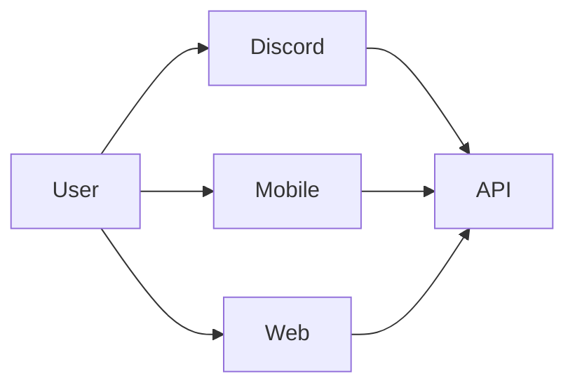

Each client acts as an adapter.

---

## Discord Example

User runs:

```text
/create-task Buy Milk
```

Discord Bot:

```ts
POST /tasks
{
  title: "Buy Milk"
}
```

The bot never creates the task itself.

---

# API Layer

Initially this is simply Fastify.

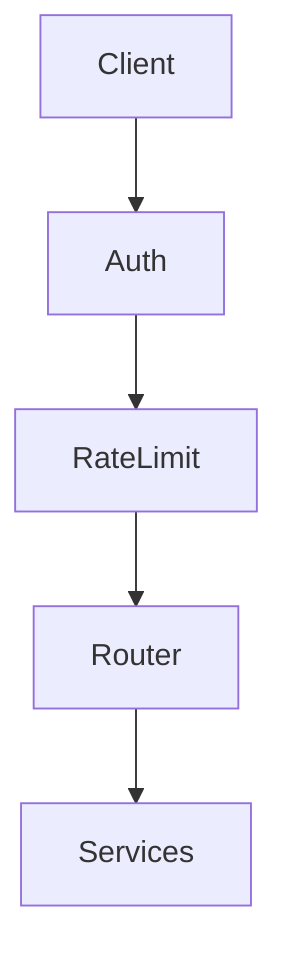

Responsibilities:

### Authentication

```text
JWT
OAuth
Discord OAuth
API Keys
```

---

### Rate Limiting

Protects:

```text
Discord Spam
Bot Abuse
API Abuse
```

---

### Request Routing

```text
/api/users
/api/permissions
/api/messages
/api/plugins
```

Routes requests to domain services.

---

# Why Not Let Clients Call Services Directly?

Bad:

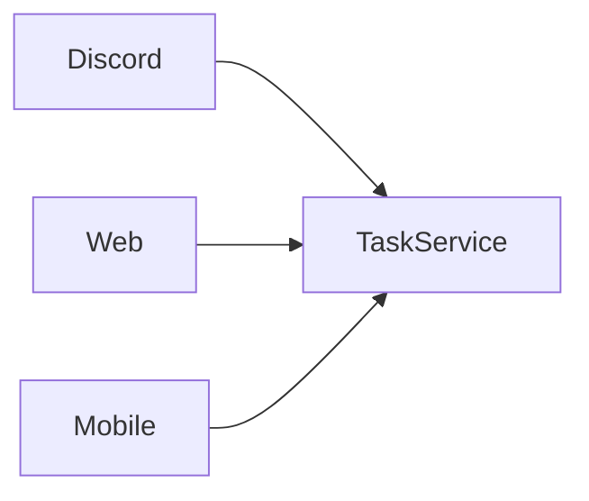

Eventually:

```text
Discord special case
Web special case
Mobile special case
```

Chaos.

---

Good:

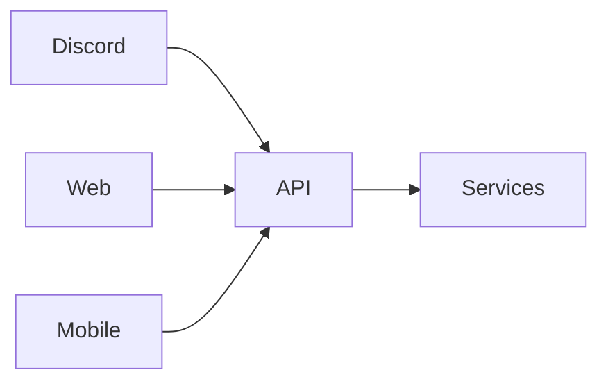

Single entry point.

---

# Domain Services

Each domain owns its logic.

### Core domains (start here):

```text
users/
permissions/
messages/
plugins/
```

### Future optional domains (add when needed):

```text
tasks/
ai/
workflows/
knowledge/
```

Rule:

> Only add domains when needed.

---

Structure:

```text
src/

  api/

  users/
  permissions/
  messages/

  plugins/

  events/
    event-bus.ts

  database/
```

---

Example

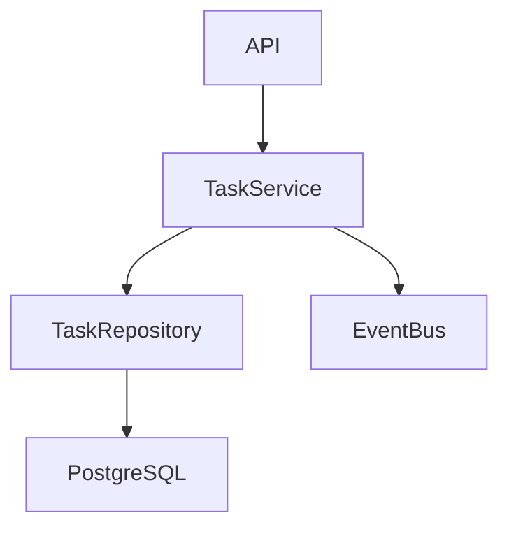

---

# Event Bus

This is where extensibility begins.

After something happens:

```text
User Created
Task Created
Message Received
Permission Updated
```

An event is emitted.

---

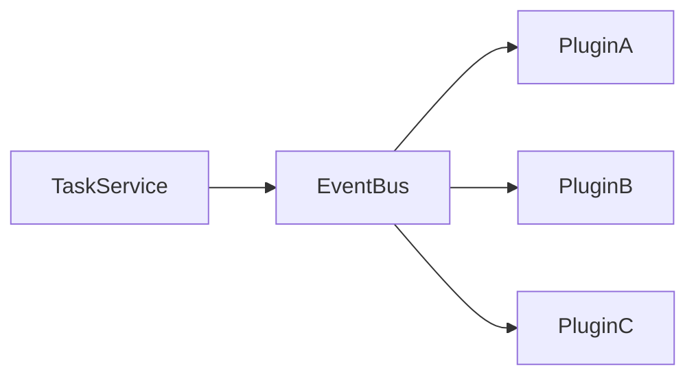

---

Example

```ts
eventBus.emit("task.created", task)
```

Nobody knows who listens.

Nobody cares.

Loose coupling.

---

# Plugin System

The most important part.

Plugins are event subscribers — not hooks into core logic.

---

Plugin Registration

```ts
export default {
  name: "notification-plugin",
  events: {
    "task.created": async (task) => {
      sendNotification(task)
    },
    "message.received": async (message) => {
      logMessage(message)
    }
  }
}
```

---

Core Startup

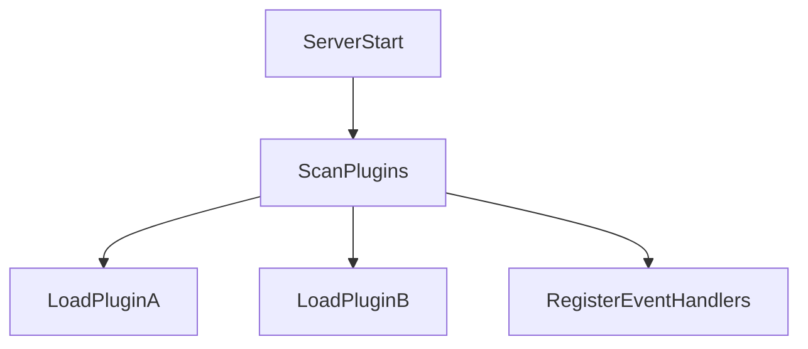

---

Plugin Registry

```ts
registry.register(plugin)
```

Internally:

```text
message.received
├── Plugin A
├── Plugin B
└── Plugin C

task.created
├── Plugin X
└── Plugin Y
```

---

# Event Flow

Full example:

User creates task.

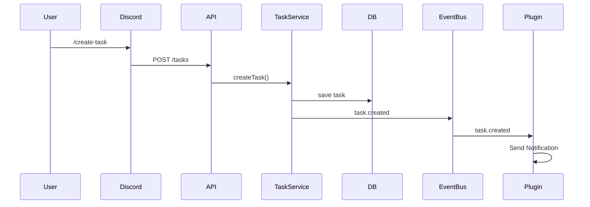

Notice:

```text
TaskService
does not know
Plugin exists
```

This is huge.

---

# Extensibility Model

```text
Service emits event
        ↓
Plugins react independently
```

This allows:

```text
New features without modifying core services
Independent plugin development
Clean separation of concerns
```

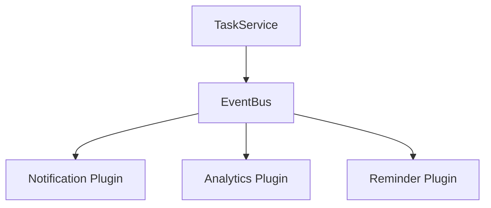

---

# Plugin Context

Plugins need controlled access.

```ts
interface PluginContext {
  db
  eventBus
  logger
  config
}
```

---

Bad:

```text
Plugin gets root access
```

Good:

```text
Plugin gets approved capabilities
```

---

# Capability System

Future enhancement:

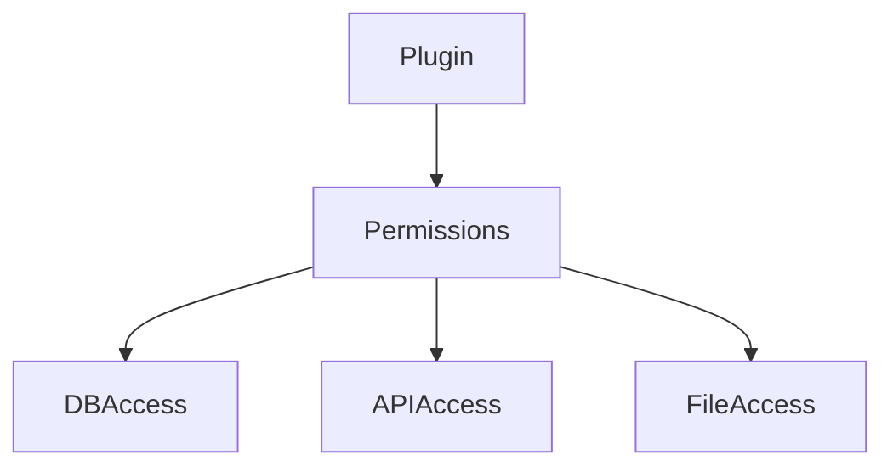

Example:

```json
{
  "permissions": [
    "tasks.read",
    "tasks.write"
  ]
}
```

---

# Shared Event Schema

Probably the most important long-term decision.

---

Every event:

```ts
interface Event {
  id: string
  type: string
  timestamp: number
  source: string
  payload: unknown
}
```

---

Example

```json
{
  "id": "evt_123",
  "type": "task.created",
  "timestamp": 123456789,
  "source": "tasks",
  "payload": {
    "taskId": 42
  }
}
```

---

Benefits

```text
Plugins remain compatible
Replay events
Analytics
Auditing
Logging
Versioning
```

---

# Database Layer

Use:

```text
PostgreSQL
```

---

Architecture

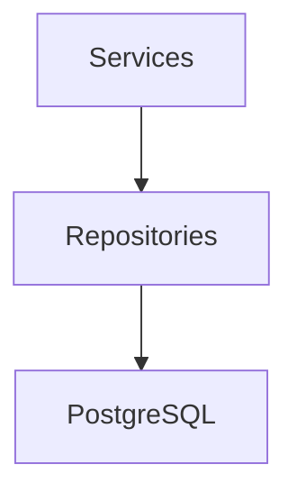

---

Never:

```text
Plugin
  ↓
Direct SQL
```

Initially.

Instead:

```text
Plugin
  ↓
Service APIs
```

Cleaner boundaries.

---

# Redis (Optional — Later)

Redis is not required for Phase 1.

When needed:

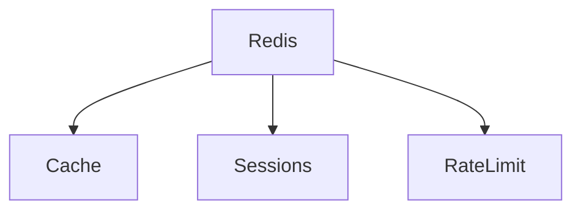

---

Examples:

```text
Cache expensive AI responses
Store sessions
Rate limiting
```

Not used for the event bus at this stage.

---

# Technology Stack

## Backend

```text
TypeScript
Fastify
```

## Frontend

```text
Next.js
```

## Mobile

```text
React Native / Expo
```

## Database

```text
PostgreSQL
```

## Optional (Later)

```text
Redis — caching / scaling
```

## Deployment

```text
Docker Compose
```

---

# Folder Structure

```text
src/

  api/

  users/
  permissions/
  messages/

  plugins/

  events/
    event-bus.ts

  database/
```

Clients live separately:

```text
apps/

  discord/
  web/
  mobile/
```

---

# Deployment

Start simple.

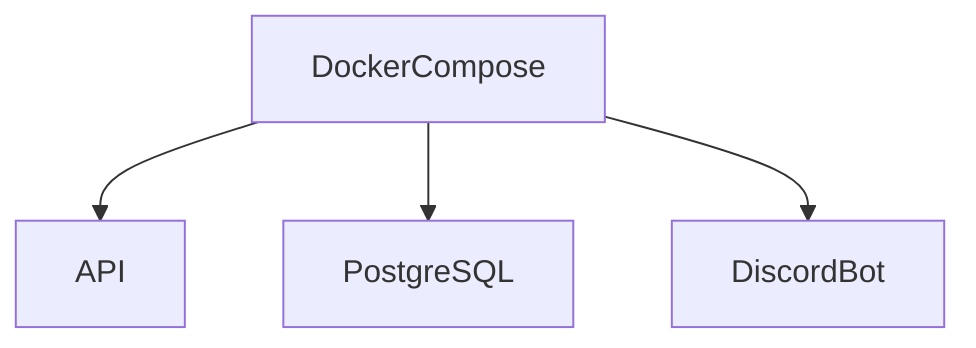

---

Example

```yaml
services:
  api:
  postgres:
  discord:
```

Single VPS.

Very manageable.

Redis and additional services added only when needed.

---

# Evolution Path

### Phase 1 (Current Target)

```text
Fastify + Services + PostgreSQL + Event Bus + Plugins
```

---

### Phase 2

```text
Web app + Mobile app + Redis
```

---

### Phase 3

```text
Background jobs + notifications + scheduling
```

---

### Phase 4

```text
Advanced plugins + external integrations
```

Only evolve when real need appears.

---

# What This System Is

This is:

> A modular backend platform with event-driven extensibility

Not:

```text
Microservices system
Distributed event architecture
Enterprise CQRS system
```

---

# Why This Architecture Works

## Benefits

```text
Simple to understand
Easy to extend via plugins
Centralized business logic
Low initial complexity
Naturally evolves into larger system
```

---

# Final Architecture

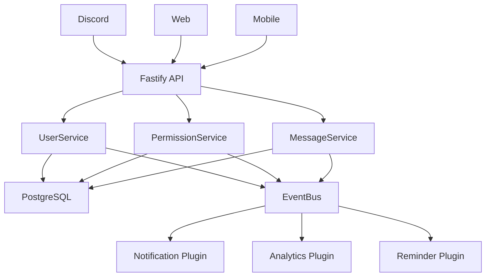

This design gives you:

* **One source of truth** for business logic
* **Multiple interfaces** (Discord, web, mobile, CLI)
* **Strong extensibility** through event subscribers
* **Simple initial deployment**
* A clean path to evolve without major rewrites

---

# Suggested Skills for Future Agent

```text
TypeScript
Fastify
Event-driven architecture
PostgreSQL
REST API design
Plugin systems
Backend service architecture
Authentication & authorization
Docker Compose
Next.js (for frontend integration)
```
